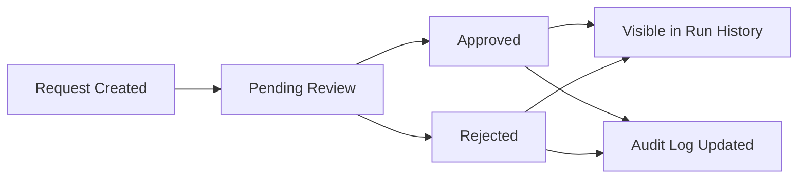
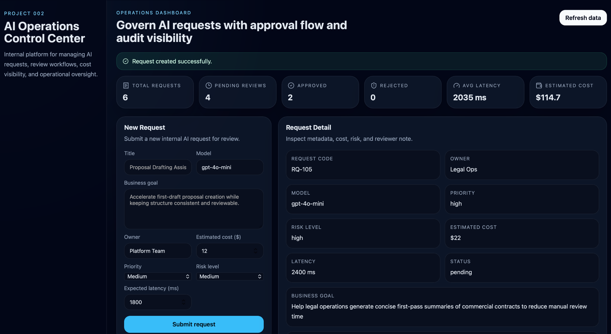
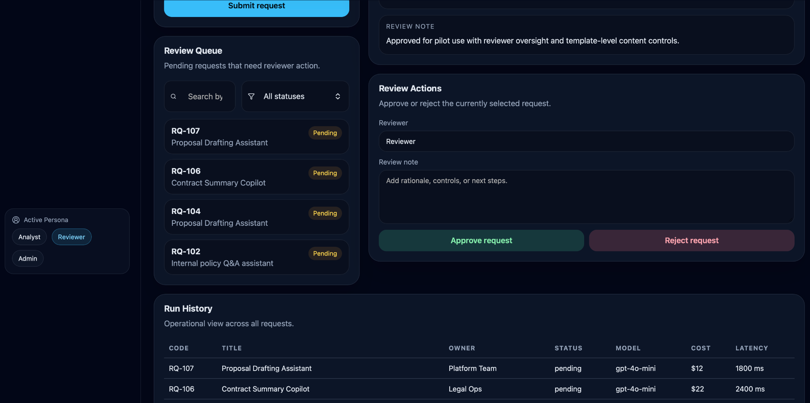
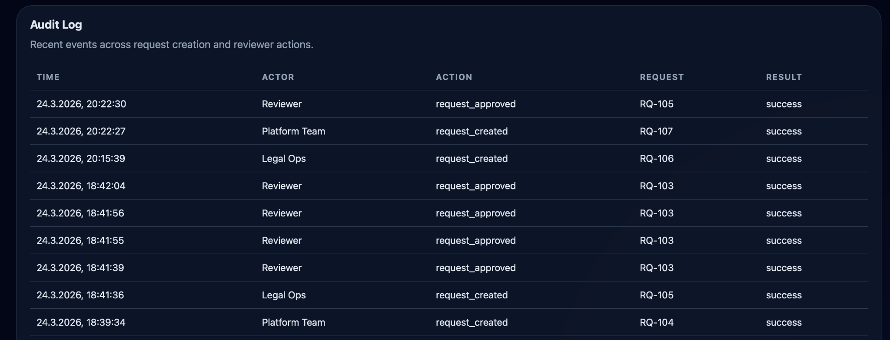

# AI Operations Control Center

A production-minded internal platform for managing AI requests, review workflows, operational visibility, and cost/risk tracking.

This project was built as a portfolio asset for an architect-track GenAI / AI systems profile. It demonstrates how internal AI requests can be made visible, reviewable, and auditable through a structured workflow rather than treated as ad hoc experiments.

---

## What it does

- Creates and manages internal AI requests
- Supports reviewer approval and rejection workflows
- Exposes operational KPIs through a dashboard
- Shows request metadata, cost, latency, and status
- Maintains an audit log of key events
- Provides a React-based internal operations UI
- Uses a FastAPI backend with SQLite persistence for local MVP execution

---

## Why this project matters

Many AI demos focus only on generation quality or feature UX.  
This project focuses on a different but equally important layer:

**AI operations and governance**

Instead of asking only *"Can the model generate something useful?"*, this platform asks:

- Who requested the AI workflow?
- What business value is expected?
- What risk level does it carry?
- Who approved or rejected it?
- What cost and latency profile does it have?
- How do we preserve audit visibility?

That makes the project more aligned with internal enterprise workflows, AI governance thinking, and architect-track system design.

---

## Architecture decisions

### Why React + FastAPI

This stack was chosen to keep the system modular and easy to reason about.

- **React** provides a clean operations dashboard experience for request management, queue review, and audit visibility.
- **FastAPI** provides a lightweight backend API for request lifecycle management, metrics, and log retrieval.

This separation mirrors a realistic internal tooling pattern: a frontend control plane on top of a service-oriented backend.

### Why SQLite in v1

SQLite is sufficient for a portfolio-grade MVP because it keeps setup simple and makes the project runnable locally in minutes.

For a production version, the storage layer would move to **PostgreSQL**.

### Why request / review / audit separation

The platform is intentionally divided into:

- request submission
- review actions
- audit visibility

This reflects how internal AI governance platforms typically operate: one group proposes AI use cases, another evaluates readiness and risk, and the system records operational traceability.

### Why auth is not included in v1

Authentication and RBAC were intentionally excluded from the first version to keep the MVP focused on workflow design, operational visibility, and review logic.

In a production version, **RBAC** would be one of the first major upgrades.

---

## Request lifecycle



---

## Core features

- KPI dashboard for:
  - total requests
  - pending reviews
  - approved requests
  - rejected requests
  - average latency
  - total estimated cost
- New request submission form
- Request detail panel
- Review queue with approve / reject actions
- Run history table
- Audit log table
- Role/persona simulation:
  - Analyst
  - Reviewer
  - Admin
- Search and status filtering for request views
- Local seeded demo data for immediate testing

---

## Demo preview

### Overview


### Review Queue and Run History


### Audit Log


---

## Project structure

```text
ai-operations-control-center/
├── app/
│   ├── api/
│   ├── core/
│   ├── db/
│   ├── models/
│   ├── services/
│   └── main.py
├── tests/
├── ui/
│   ├── src/
│   └── ...
├── docs/
│   └── images/
├── .env.example
├── .gitignore
├── README.md
└── requirements.txt
```

---

## Local setup

### 1. Create and activate a virtual environment

```bash
python3 -m venv .venv
source .venv/bin/activate
```

### 2. Install backend dependencies

```bash
pip install -r requirements.txt
```

### 3. Create the environment file

```bash
cp .env.example .env
```

### 4. Start the backend

```bash
python -m uvicorn app.main:app --reload
```

Backend runs at:

```text
http://127.0.0.1:8000
```

API docs:

```text
http://127.0.0.1:8000/docs
```

### 5. Start the frontend

```bash
cd ui
npm install
npm run dev
```

Frontend runs at:

```text
http://127.0.0.1:5173
```

---

## Main API endpoints

### Health
- `GET /health`

### Requests
- `GET /requests`
- `POST /requests`
- `GET /requests/{id}`
- `PATCH /requests/{id}`

### Review actions
- `POST /requests/{id}/approve`
- `POST /requests/{id}/reject`

### Metrics
- `GET /metrics/summary`
- `GET /metrics/dashboard`

### Audit
- `GET /audit-logs`

---

## Example workflow

1. Open the dashboard UI
2. Create a new AI request
3. Inspect the generated request in the request detail panel
4. Review the item in the review queue
5. Approve or reject the request
6. Verify:
   - KPI updates
   - status changes
   - run history entry
   - audit log entry

---

## What this project demonstrates

This project is designed to show capability in:

- Internal AI workflow design
- Operational dashboard thinking
- Governance-oriented product design
- Review and approval logic
- Auditability and visibility
- React + FastAPI integration
- MVP scoping for enterprise-style tools
- Architect-track system reasoning

---

## Current limitations

This is an MVP and not a full production deployment.

Current limitations:

- No real authentication
- No real RBAC enforcement
- No async jobs or notifications
- No pagination on large datasets
- SQLite instead of a production-grade database
- No observability / tracing stack
- No deployment pipeline by default
- No external integrations such as Slack, Notion, or email

---

## Production path

This project is intentionally scoped as a production-minded MVP, not a full enterprise deployment.

If expanded into a real internal platform, the next architectural steps would be:

- Replace SQLite with PostgreSQL
- Add authentication and role-based access control
- Move review actions and notifications into async background jobs
- Add filtering, pagination, and stronger search
- Introduce tracing, observability, and operational alerts
- Persist richer audit events with retention policies
- Add environment-based deployment configuration and secret management
- Support multi-team or workspace isolation

The current version focuses on the most important first step: making AI request workflows visible, reviewable, and auditable.

---

## Future improvements

- Authentication and RBAC
- Richer filtering and search
- Request tagging and categorization
- Reviewer assignment workflows
- Event notifications
- Audit export / CSV download
- Deployment to public demo infrastructure
- Stronger metrics and operational analytics
- Queue-based background execution model

---

## Portfolio context

This project is part of a broader architect-track portfolio focused on:

- GenAI applications
- AI operations and governance
- Evidence-aware workflows
- Production-minded AI system design

Within that portfolio, this project represents the **AI operations / governance layer**, complementing application-layer projects with workflow, review, and audit visibility.

---

## Author

**Zamil Hasanov**

- LinkedIn: https://www.linkedin.com/in/zamillion/
- GitHub: https://github.com/Zamil00